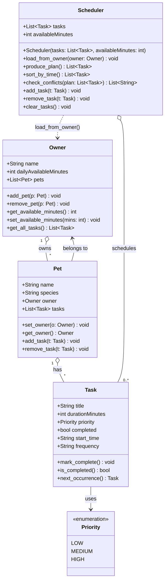

# PawPal+ — Final Class Diagram

## Changes from initial UML

| What changed | Why |
|---|---|
| `Pet` gained `tasks` list + `add_task()` / `remove_task()` | Tasks need a home on the pet, not floating globally |
| `Owner` gained `get_all_tasks()` | Clean bridge so Scheduler doesn't walk pet internals directly |
| `Scheduler` gained `load_from_owner()`, `sort_by_time()`, `check_conflicts()` | Phase 3 features: time sorting and conflict detection |
| `Task` gained `start_time`, `frequency`, `next_occurrence()` | Support for clock-based scheduling and daily/weekly recurrence |
| Added `Pet "1" o-- "*" Task` relationship | Reflects the actual ownership added in implementation |
| Added `Scheduler ..> Owner` dependency | Reflects `load_from_owner()` call |
